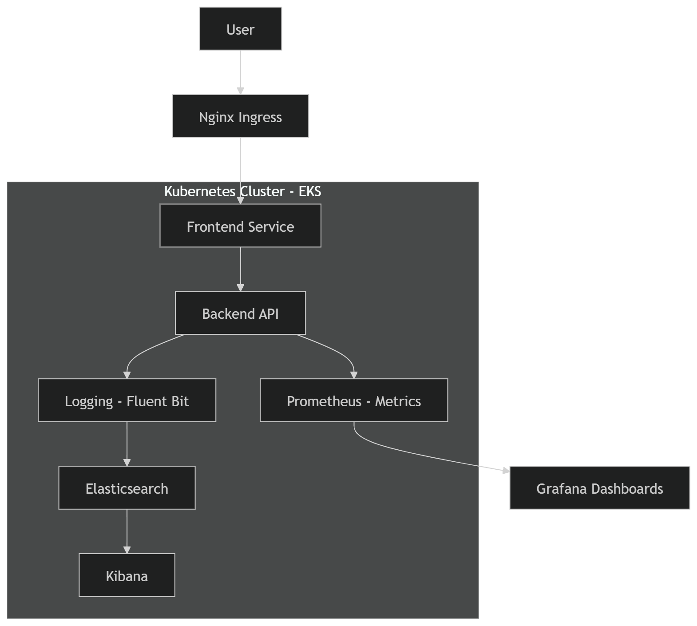
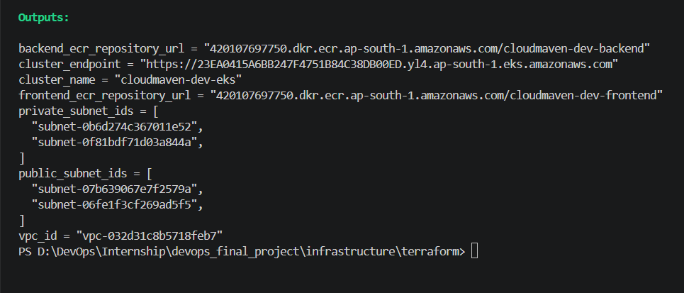
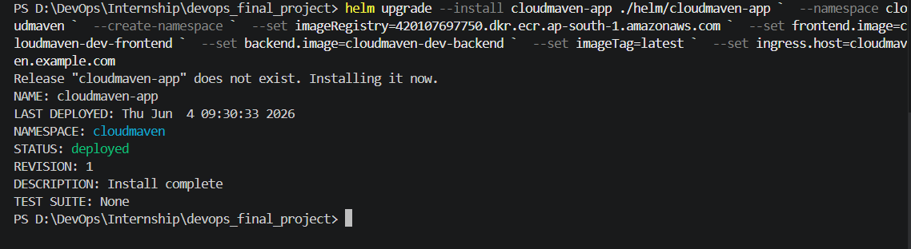
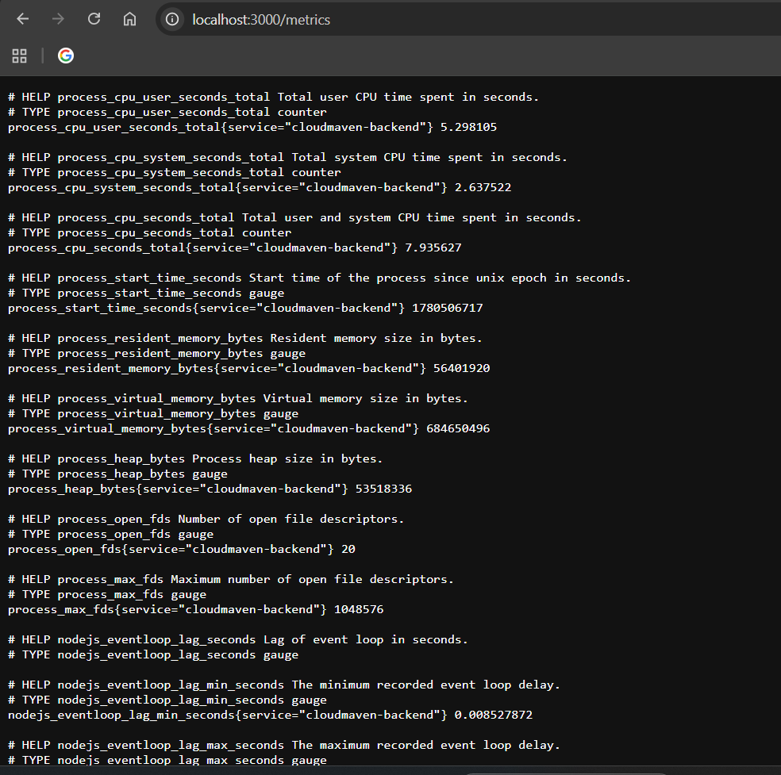
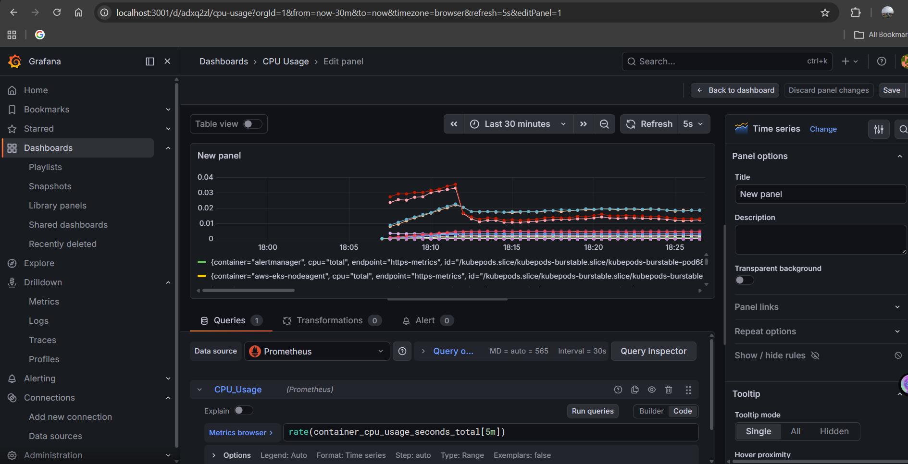
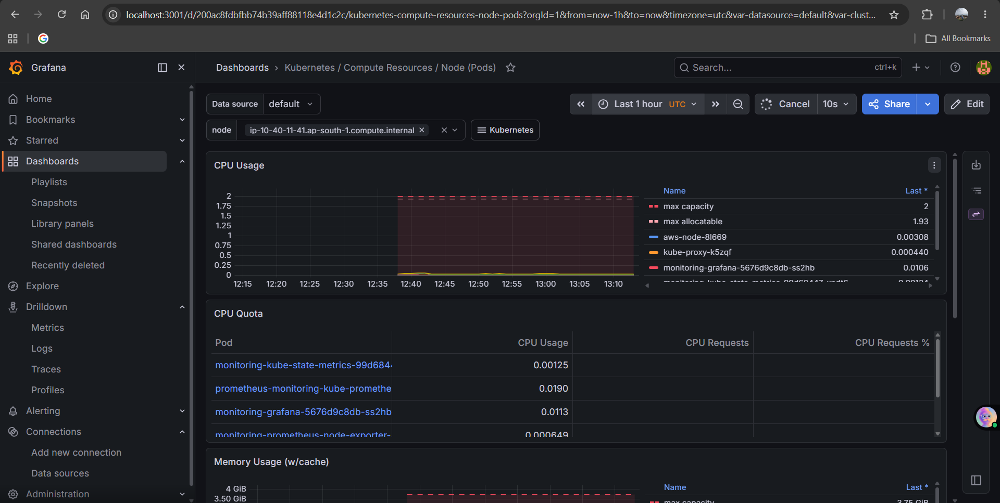
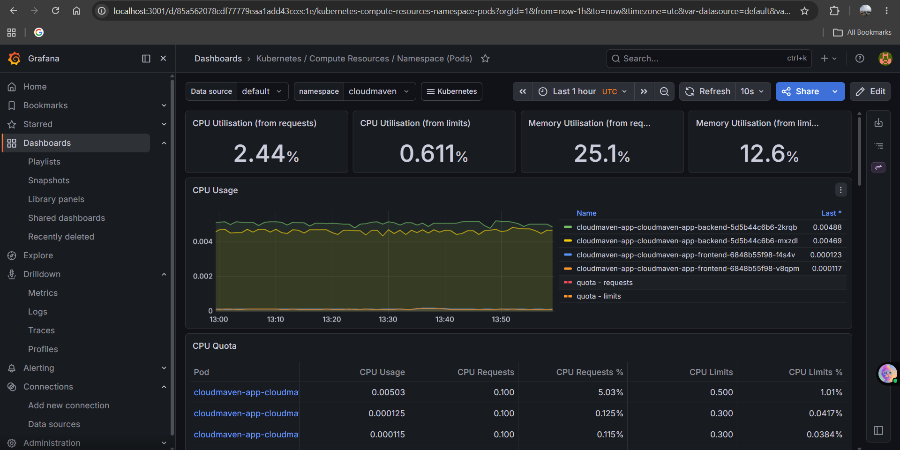
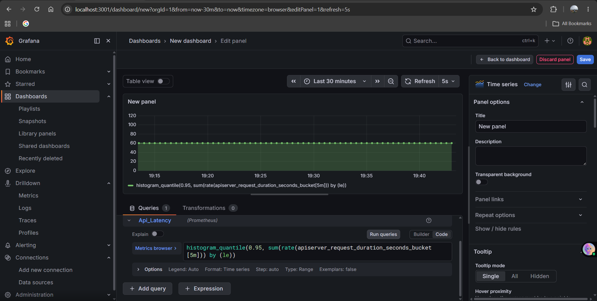
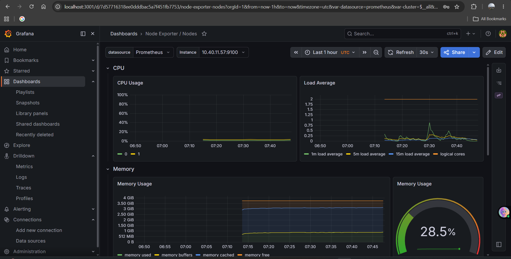

# 🚀 CloudMaven DevOps Intern Assessment


---

## 📌 Project Overview

A **production-style DevOps project** deploying a **2-tier Node.js application** on **AWS EKS**, fully automated using:

- Infrastructure as Code (Terraform)
- Containerization (Docker)
- Kubernetes + Helm
- CI/CD (GitHub Actions)
- Observability (Prometheus, Grafana, ELK Stack)

---

## 🏗️ System Architecture



---

## 📁 Project Structure

```
apps/
 ├── backend/        # Node.js API (/health, /metrics, logs)
 ├── frontend/       # UI service

helm/cloudmaven-app/ # Helm charts

infrastructure/
 └── terraform/     # AWS VPC + EKS provisioning

modules/
 └── eks/           # Custom EKS Terraform module

observability/
 ├── prometheus
 ├── grafana
 ├── elasticsearch
 ├── kibana
 └── fluent-bit

.github/workflows/   # CI/CD pipelines
docs/                # Screenshots & documentation
```

---

## 🧰 Tech Stack

| Layer | Tools |
|------|------|
| ☁️ Cloud | AWS (EKS, VPC, IAM, EC2) |
| 📦 IaC | Terraform |
| 🐳 Containers | Docker |
| ☸️ Orchestration | Kubernetes, Helm |
| 🔄 CI/CD | GitHub Actions |
| 📊 Monitoring | Prometheus, Grafana |
| 📄 Logging | ELK Stack (Fluent Bit, Elasticsearch, Kibana) |

---

## 🚀 Infrastructure Deployment

### 1️⃣ Create Remote State Backend

```bash
aws s3 mb s3://priti-devops-tfstate-2026 --region ap-south-1

aws dynamodb create-table \
  --table-name cloudmaven-terraform-locks \
  --attribute-definitions AttributeName=LockID,AttributeType=S \
  --key-schema AttributeName=LockID,KeyType=HASH \
  --billing-mode PAY_PER_REQUEST \
  --region ap-south-1
```

---

### 2️⃣ Deploy Terraform Infrastructure

```bash
cd infrastructure/terraform

cp terraform.tfvars.example terraform.tfvars

terraform init -backend-config=backend.tf
terraform fmt 
terraform validate
terraform plan -out tfplan
terraform apply tfplan
```
---



---

### 3️⃣ Configure Kubernetes Access

```bash
aws eks update-kubeconfig \
  --name cloudmaven-dev-eks \
  --region ap-south-1
```

---

## ☸️ Application Deployment (Helm)

### Install Ingress Controller

```bash
helm repo add ingress-nginx https://kubernetes.github.io/ingress-nginx

helm upgrade --install ingress-nginx ingress-nginx/ingress-nginx \
  --namespace ingress-nginx --create-namespace
```

---

### Deploy Application

```bash
helm upgrade --install cloudmaven-app ./helm/cloudmaven-app \
  --namespace cloudmaven --create-namespace \
  --set imageRegistry=AWS_ACCOUNT_ID.dkr.ecr.ap-south-1.amazonaws.com \
  --set ingress.host=cloudmaven.example.com
```
---



---

## API Metrics



---

## 📊 Observability Stack

### 📈 Prometheus + Grafana

```bash
helm repo add prometheus-community https://prometheus-community.github.io/helm-charts

helm upgrade --install monitoring prometheus-community/kube-prometheus-stack \
  --namespace monitoring --create-namespace \
  -f observability/prometheus-grafana-values.yaml
```

---

### 📄 ELK Stack (Logging)

```bash
helm repo add elastic https://helm.elastic.co
helm repo add fluent https://fluent.github.io/helm-charts

helm upgrade --install elasticsearch elastic/elasticsearch \
  --namespace logging --create-namespace \
  -f observability/elasticsearch-values.yaml

helm upgrade --install kibana elastic/kibana \
  --namespace logging \
  -f observability/kibana-values.yaml

helm upgrade --install fluent-bit fluent/fluent-bit \
  --namespace logging \
  -f observability/fluent-bit-values.yaml
```

---

## 📊 Monitoring & Observability Highlights

### 📈 Grafana Dashboards
- CPU & Memory (Pods + Nodes)
- API latency tracking
- Request count & throughput
---



---



---



---



---



---

### 📊 Kibana Dashboards
- Application logs (`cloudmaven-*`)
- Error tracking
- HTTP status codes
- Top API endpoints

---

## 🔁 CI/CD Pipeline

### 🔄 Pull Request Pipeline
- Terraform format & validate
- Docker build verification
- Helm lint & template rendering
- Artifact generation

### 🚀 Main Branch Deployment
- Terraform apply
- Docker build & push to ECR
- Helm deploy to EKS
- Rollout verification
- API smoke testing

---

## 🔐 GitHub Secrets

```
AWS_ACCESS_KEY_ID
AWS_SECRET_ACCESS_KEY
AWS_REGION
ECR_REGISTRY
APP_HOST
TF_STATE_BUCKET
TF_LOCK_TABLE
```

---

## 🐛 Issues & Solutions

| Issue | Fix |
|------|-----|
| Issue in Pulling EKS Container Images | correcting image repository/tag |
| Cannot access Kibana | 
|Helm Upgrade Failure due to Stuck Release State |performing rollback/uninstall to clear stuck|
|Grafana Showing “No Data” Dashboards| 

---

## ⭐ Why This Project Matters

✔ Demonstrates real-world DevOps workflow  
✔ Production-grade Kubernetes deployment  
✔ Full observability stack implementation  
✔ End-to-end automation using CI/CD  
✔ Cloud-native architecture design  

---
